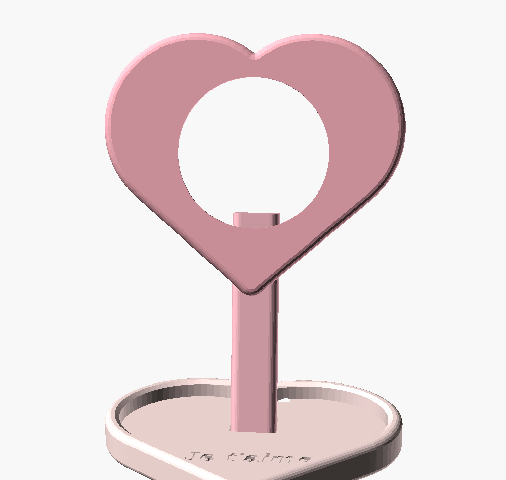

# Station chargeur MagSafe en forme de cœur

Station de charge d'après la fiche produit : une **tête en cœur** qui accueille
le chargeur MagSafe affleurant (la lentille du cœur), une **tige** avec passage
de câble intégré, une **base vide-poches en cœur** avec « Je t'aime » gravé au
fond. Trois pièces imprimées, emboîtées sans vis. Pensée pour une **Bambu Lab
A1**, PLA (rose recommandé !), **sans supports**.



| # | Pièce | Fichier | Impression |
|---|---|---|---|
| 1 | Cœur (support MagSafe) | `stl/station_coeur.stl` | à plat, dos sur le plateau |
| 2 | Tige | `stl/station_tige.stl` | debout, brim conseillé |
| 3 | Base (vide-poches + passage de câble) | `stl/station_base.stl` | à plat |

Dimensions : cœur 100 × 87 × 18 mm, base 104 × 91 × 12 mm, hauteur assemblée
≈ 138 mm. La tête est inclinée de 12° vers l'arrière ; la hauteur est un peu
plus généreuse que la fiche (130) pour qu'un iPhone Pro Max ne descende pas
dans le vide-poches.

## Paramètres (OpenSCAD)

```openscad
part = "assembly";   // assembly | coeur | tige | base | cable_section
magsafe_diameter  = 56.2;   // logement Ø ~57, profondeur 5,8 (affleurant)
head_tilt         = 12;     // inclinaison de la tête
decorative_text   = "Je t'aime";  // gravé dans le vide-poches
```

## Impression (Bambu Studio)

PLA, buse 0,4, couche 0,20 mm, 4 parois, remplissage 15–20 % (base : 30 % pour
le lest), **aucun support**. Orientations déjà appliquées dans les STL.

## Assemblage

1. Insérer le chargeur MagSafe **par l'arrière du cœur**, câble vers le bas :
   il glisse dans son logement (chanfrein d'entrée) et se clipse derrière
   trois bossettes, plaqué contre la lèvre frontale — le téléphone charge à
   travers l'ouverture de 50 mm et ne peut pas l'arracher. Pour le retirer,
   le pousser doucement par l'ouverture frontale.
2. Faire passer le câble derrière le palet, le descendre dans la mortaise au
   dos du cœur et le clipser dans la rainure à lèvres de la tige.
3. Glisser la fiche USB-C dans la mortaise de la base, puis emboîter la tige
   (elle traverse la base et affleure le dessous). Un point de colle
   cyanoacrylate dans les mortaises rend l'ensemble définitif.
4. Retourner la base, poser le câble dans la rainure du dessous et le sortir
   par l'encoche arrière.
5. Coller 40 à 70 g de lest (écrous, rondelles, plombs) dans la poche à
   croisillon sous l'avant de la base — la station reste bien en place quand
   on décroche le téléphone.
6. Coller 4 patins silicone Ø 8 mm dans leurs logements. C'est prêt.

**Retrait du téléphone** : le chargeur, lui, ne bouge jamais — la traction des
aimants le plaque contre la lèvre frontale. Pour décoller le téléphone d'une
seule main, le faire glisser/pivoter plutôt que de tirer droit (comme sur
tout socle MagSafe léger).

## Compatibilité

Chargeur MagSafe officiel Apple (Ø 56,2 × 5,7 mm) ; iPhone 12 et suivants.
Usage intérieur. Le téléphone est tenu par les aimants du chargeur, posé
en travers du cœur — la bosse caméra passe au-dessus des lobes.
