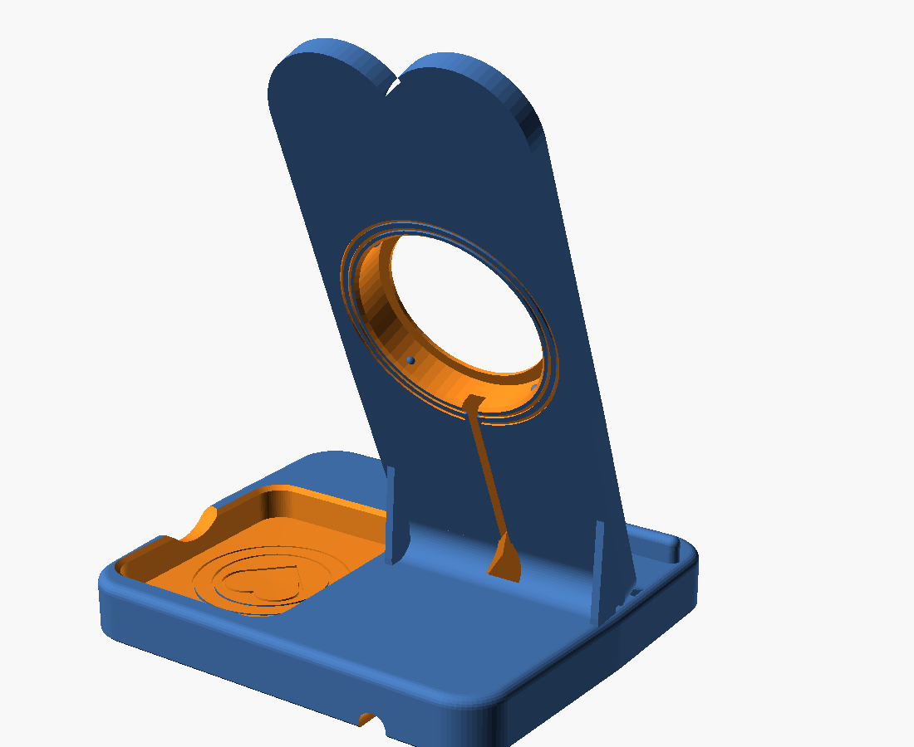

# Station de recharge MagSafe — cœur style Vespa vintage (monobloc)

Station de charge pour iPhone (MagSafe) avec vide-poches intégré, pensée comme
un cadeau : le **dossier est un grand cœur** (deux lobes au sommet, pointe
fondue dans le socle) inspiré des courbes d'un scooter italien rétro — phare
rond strié en façade (le chargeur MagSafe en est la « lentille »), carénage
façon tablier de klaxon, « Je t'aime » en relief sous le creux du cœur.
Conçue pour une **Bambu Lab A1** (256 × 256 × 256 mm), en **mono-couleur**,
**sans AMS**.


**Une seule pièce imprimée :**

| Pièce | Fichier | Impression |
|---|---|---|
| Corps monobloc (base + vide-poches + dossier 68° + rebord + phare + texte + conduit de câble + patins + lest) | `stl/station_corps_monobloc.stl` | debout, supports **uniquement** dans le logement MagSafe |

Sans cache ni vis : le chargeur MagSafe se **clipse** dans son logement
(quatre bossettes de retenue, il se retire en le repoussant par l'ouverture
frontale) et le câble se **clipse** dans sa rainure à lèvres (profil oméga,
ouverture 3,6 mm pour un câble de 4,2 mm). Le dos est décoré d'anneaux
gravés autour du logement.

Vous préférez un cache arrière vissé ? Mettez `use_rear_cover = true`,
ré-exportez le corps (les pilotes de vis apparaissent) et imprimez
`stl/station_cache_arriere.stl` (4 × M3 × 6, aucun support).

Pièces complémentaires :

| Pièce | Fichier | Rôle |
|---|---|---|
| **Test de tolérances** | `stl/station_test_magsafe.stl` | petit extrait (76 × 84 × 12 mm, ≈ 1 h) : logement MagSafe complet avec ses clips et rainure à lèvres — clipser le chargeur et le câble pour tout valider avant la grande impression |
| Plaque de lest | `stl/station_plaque_lest.stl` | ferme la cavité de lest (2 vis M3) |
| Badge logo générique | `stl/station_logo.stl` | optionnel, à coller (`show_logo = true`) |

Dimensions assemblées : **150 × 125 × 183 mm**. Le dossier est **fondu dans la
base** (aucun assemblage, aucune vis entre eux) : congés internes r10 avant /
r8 arrière, deux nervures latérales discrètes, épaisseur locale > 8 mm à la
jonction. Avec la cavité garnie de rondelles (~150–250 g) le centre de gravité
est très bas : un iPhone Pro Max avec coque ne fait pas basculer la station.

---

## 1. Ouvrir le fichier dans OpenSCAD

1. Installer [OpenSCAD](https://openscad.org) (2021.01 ou plus récent).
2. Ouvrir `station_vespa_magsafe.scad`.
3. **F5** (aperçu) ou **F6** (rendu complet). Aucune bibliothèque externe.

## 2. Choisir la pièce avec la variable `part`

```openscad
part = "assembly";
// assembly       -> toutes les pièces assemblées
// corps          -> corps monobloc (orientation d'impression : debout)
// cache          -> cache arrière (face décorée sur le plateau)
// test           -> pièce de test rapide du logement MagSafe
// logo           -> badge logo générique séparé
// cable_section  -> vue en coupe de tout le passage du câble
// plaque         -> plaque de la cavité de lest
```


## 3. Modifier le diamètre du MagSafe

```openscad
magsafe_diameter  = 56.2;  // chargeur Apple d'origine
magsafe_thickness = 5.7;
```

Le logement (jeu radial 0,25 mm), l'ouverture frontale, le phare et le
poussoir du cache se recalculent automatiquement. `magsafe_center_height`
(105 mm, plage 105–115) règle la hauteur de l'axe de charge ; le téléphone est
tenu par les aimants, le rebord servant de butée de sécurité.
**Imprimez d'abord `station_test_magsafe.stl`** pour valider ces cotes.

## 4. Afficher ou masquer le texte et le logo

```openscad
show_decorative_text = true;        // texte en relief (0,8 mm)
decorative_text      = "Je t'aime"; // texte libre ("VESPA", "LA DOLCE VITA", ...)
decorative_text_size = 8;           // hauteur des lettres
text_font = "Liberation Sans:style=Bold Italic";
show_hearts          = true;        // coeurs : façade + vide-poches
show_logo            = false;       // badge rapporté + son logement
```

Le dossier est lui-même un grand cœur ; s'y ajoutent un cœur en relief sous
le phare et un cœur gravé au fond du vide-poches (`show_hearts = false` pour
les retirer). Pour une finition « cadeau » : PLA Matte rose pastel, lilas ou
blanc crème.

`show_decorative_text = false` donne la version lisse. Le texte est recoupé à
l'intérieur de la silhouette : un texte trop long ne débordera jamais.

Le lettrage cursif du logo d'origine est un dessin propriétaire (Piaggio) qui
n'est pas inclus dans ce dépôt. Pour l'obtenir sur votre impression
personnelle : installez une fonte TTF « style Vespa » sur votre machine,
indiquez son nom dans `text_font`, puis ré-exportez le corps.

## 5. Exporter chaque STL

Interface : régler `part`, **F6**, puis *Fichier → Exporter → STL*. En CLI :

```bash
openscad -o stl/station_corps_monobloc.stl -D 'part="corps"'  station_vespa_magsafe.scad
openscad -o stl/station_cache_arriere.stl  -D 'part="cache"'  station_vespa_magsafe.scad
openscad -o stl/station_test_magsafe.stl   -D 'part="test"'   station_vespa_magsafe.scad
openscad -o stl/station_plaque_lest.stl    -D 'part="plaque"' station_vespa_magsafe.scad
openscad -o stl/station_logo.stl           -D 'part="logo"'   station_vespa_magsafe.scad
```

Les STL sont déjà orientés pour l'impression (face plateau en Z = 0 ;
le corps s'imprime **debout**, posé sur le dessous de la base).

## 6. Visserie

| Usage | Vis | Quantité |
|---|---|---|
| Cache arrière → corps | M3 × 6 autotaraudeuse plastique, tête cylindrique | 4 |
| Plaque de lest → corps | M3 × 12 autotaraudeuse | 2 |

Aucune vis ne débouche sur une surface visible. Le cache se démonte et se
remonte sans contrainte sur la pièce (pilotes Ø 2,8, jeu de 0,25 mm).
Prévoir 4 patins silicone adhésifs Ø 10 mm pour le dessous.

## 7. Installer le chargeur MagSafe

1. Dévisser le cache arrière (4 × M3 × 6) — encoche de préhension en haut.
2. Présenter le chargeur **par l'arrière** dans son logement circulaire,
   câble vers le bas, dans l'axe de la rainure.
3. L'enfoncer au fond : il franchit trois bossettes de retenue et s'appuie
   contre la lèvre frontale (l'ouverture avant Ø 50 est plus petite que le
   chargeur : il ne peut pas traverser ; il affleure côté téléphone).
4. Le poussoir central du cache le plaque définitivement au fond.

Pour le retirer : ôter le cache, repousser doucement le chargeur par
l'ouverture frontale — aucune pièce ne casse au démontage.

## 8. Passer le câble

Le câble (Ø 4,2 mm) est invisible depuis l'avant : rainure de 5,2 × 5 mm dans
le dos du dossier (fermée par le cache), puis **bouche élargie à 13 mm** sous
le congé arrière — la fiche USB-C passe sans forcer — conduit interne incliné
à 68° (aucun coude brutal, cove interne r8), rainure de 7 × 4 mm sous la base
et **sortie à l'arrière** par une ouverture de 9 × 6 mm à bord arrondi.

```openscad
cable_exit = "rear";   // sortie arrière (défaut)
cable_exit = "bottom"; // la rainure débouche sous le bord arrière
```

Le câble se pose sans jamais être pincé : la rainure est plus profonde que
son diamètre et le cache l'affleure sans le serrer.

## 9. Ordre d'assemblage

1. Imprimer la **pièce de test**, y clipser le chargeur, visser le cache :
   valider les jeux, puis récupérer les vis.
2. Imprimer le corps monobloc et le cache ; retirer les supports du logement
   MagSafe (ils se détachent par l'ouverture arrière) et les éventuels fils.
3. Descendre la fiche USB-C dans la bouche du conduit derrière le dossier,
   la faire ressortir sous la base puis par la sortie arrière.
4. Poser le câble dans la rainure du dos, clipser le chargeur dans son
   logement (§ 7).
5. Poser le cache arrière et le visser (4 × M3 × 6) : il plaque le chargeur
   et maintient le câble.
6. (Option) Garnir la cavité de lest de rondelles métalliques (~150–250 g),
   visser la plaque (2 × M3 × 12).
7. Coller les 4 patins silicone dans leurs logements.
8. Brancher le câble (USB-C) et poser l'iPhone : il se centre sur les aimants.

## 10. Paramètres d'impression recommandés (Bambu Studio)

| Réglage | Valeur |
|---|---|
| Imprimante | Bambu Lab A1, buse 0,4 mm |
| Matériau | PLA Matte (ou PETG) |
| Hauteur de couche | 0,20 mm |
| Parois | 4 |
| Couches supérieures / inférieures | 5 / 5 |
| Remplissage | 20–25 % Gyroid (30 % si aucun lest) |
| Supports | **peints à la main, uniquement dans le logement MagSafe** (arbre/organiques ; ils ne touchent aucune surface visible et s'extraient par l'ouverture arrière) |
| Brim | 5 mm conseillé pour le corps (imprimé debout) |
| Couture (seam) | arrière |
| Vitesse | standard ou silencieuse pour les surfaces visibles |

Le corps s'imprime debout : la façade est à 22° de la verticale (aucun
support), le carénage sous le phare supprime le surplomb du bossage, la
cavité de lest est voûtée à 45° et tous les ponts internes font moins de
15 mm. Seul le plafond du logement MagSafe (cylindre horizontal Ø 57)
nécessite quelques supports — zone entièrement cachée derrière le chargeur.



---

### Personnalisation rapide

| Paramètre | Défaut | Rôle |
|---|---|---|
| `phone_angle` | 68 | inclinaison du téléphone (°/horizontale) |
| `cable_exit` | `"rear"` | sortie du câble arrière / dessous |
| `weight_cavity` | `true` | cavité de lest sous la base |
| `magsafe_center_height` | 105 | hauteur de l'axe de charge |
| `fillet_front_r` / `fillet_back_r` | 10 / 8 | congés de la jonction |
| `fit_clearance` | 0.25 | jeux d'emboîtement (par côté) |
