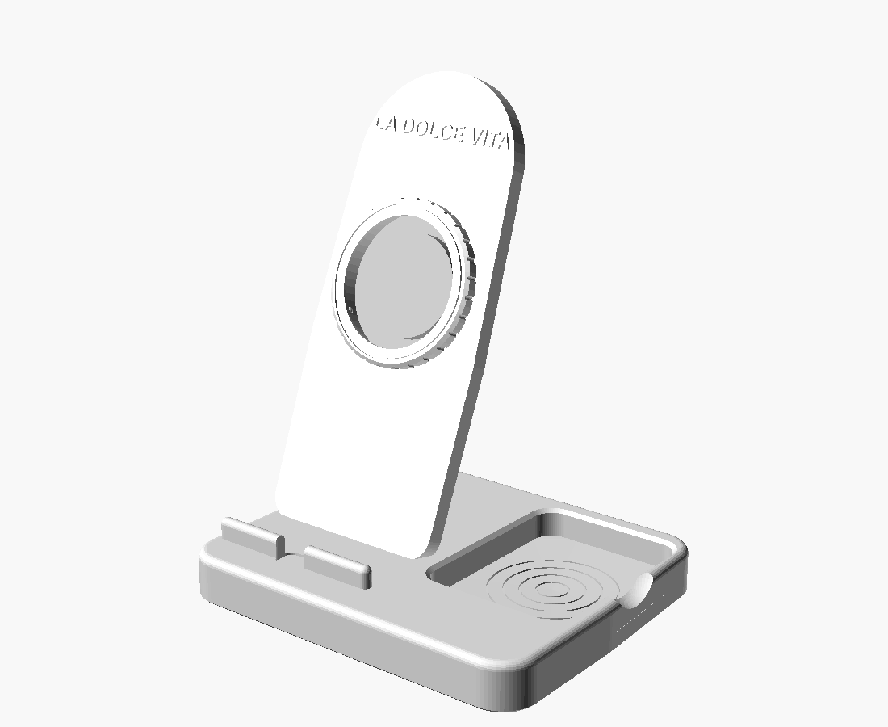
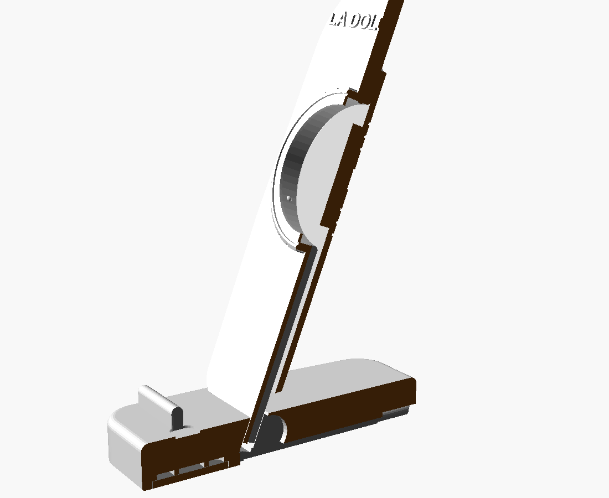

# Station de recharge MagSafe — style Vespa vintage

Station de charge pour iPhone (MagSafe) avec vide-poches intégré, inspirée des
courbes d'un scooter italien rétro : dossier galbé comme un tablier de scooter,
phare rond strié en façade (le chargeur MagSafe en est la « lentille »), cache
arrière façon roue de secours. Conçue pour une **Bambu Lab A1** (256 × 256 mm),
en **mono-couleur**, **sans AMS** et **sans supports**.



| Pièce | Fichier | Impression |
|---|---|---|
| Base (socle + rebord + vide-poches) | `stl/station_base.stl` | à plat, aucune option |
| Dossier incliné (logement MagSafe) | `stl/station_dossier.stl` | dos sur le plateau, brim conseillé |
| Cache arrière | `stl/station_cache_arriere.stl` | face décorée sur le plateau |
| Plaque de lest (optionnelle) | `stl/station_plaque_lest.stl` | à plat |
| Badge logo générique (optionnel) | `stl/station_logo.stl` | à plat |

Dimensions assemblées : **150 × 125 × 180 mm**. Toutes les pièces sont des
solides fermés (vérifiés manifold) et tiennent individuellement sur le plateau.

---

## 1. Ouvrir le fichier dans OpenSCAD

1. Installer [OpenSCAD](https://openscad.org) (version 2021.01 ou plus récente).
2. Ouvrir `station_vespa_magsafe.scad`.
3. Appuyer sur **F5** (aperçu rapide) ou **F6** (rendu complet).

Aucune bibliothèque externe n'est nécessaire. La police utilisée pour le texte
est *Liberation Sans* (installée par défaut avec OpenSCAD).

## 2. Choisir la pièce avec la variable `part`

En tête de fichier (ou via le *Customizer*) :

```openscad
part = "assembly";
// assembly       -> toutes les pièces assemblées
// base           -> la base seule (orientée pour l'impression)
// dossier        -> le dossier seul (dos sur le plateau)
// cache          -> le cache arrière seul
// logo           -> badge logo générique séparé
// cable_section  -> vue en coupe montrant tout le passage du câble
// plaque         -> plaque de la cavité de lest (bonus)
```

La vue `cable_section` coupe l'assemblage dans l'axe du canal :



## 3. Modifier le diamètre du MagSafe

```openscad
magsafe_diameter  = 56.2;  // chargeur Apple d'origine
magsafe_thickness = 5.7;
```

Pour un chargeur compatible d'un autre diamètre, changer ces deux valeurs :
le logement, le jeu radial (0,25 mm), le phare et le poussoir du cache se
recalculent automatiquement. `magsafe_center_height` (105 mm par défaut,
plage conseillée 105–115) règle la hauteur de l'axe de charge ; le téléphone
est tenu par les aimants, le rebord servant de sécurité — descendre vers
~92 mm si vous préférez qu'un iPhone Pro Max repose exactement sur le rebord.

## 4. Afficher ou masquer le texte et le logo

```openscad
show_decorative_text = true;             // texte en relief (0,8 mm)
decorative_text      = "LA DOLCE VITA";  // ou "SCOOTER CLUB", ou ""
show_logo            = false;            // badge rapporté + son logement
```

`show_decorative_text = false` donne la version totalement lisse, sans
marque. Le texte est automatiquement recoupé à l'intérieur de la silhouette :
un texte trop long ne débordera jamais. Aucun logo protégé n'est utilisé.

## 5. Exporter chaque STL

Dans l'interface : régler `part`, **F6**, puis *Fichier → Exporter → STL*.

En ligne de commande :

```bash
openscad -o stl/station_base.stl          -D 'part="base"'    station_vespa_magsafe.scad
openscad -o stl/station_dossier.stl       -D 'part="dossier"' station_vespa_magsafe.scad
openscad -o stl/station_cache_arriere.stl -D 'part="cache"'   station_vespa_magsafe.scad
openscad -o stl/station_logo.stl          -D 'part="logo"'    station_vespa_magsafe.scad
openscad -o stl/station_plaque_lest.stl   -D 'part="plaque"'  station_vespa_magsafe.scad
```

Les STL fournis sont déjà orientés pour l'impression (face plateau en Z = 0).

## 6. Visserie

| Usage | Vis | Quantité |
|---|---|---|
| Cache arrière → dossier | M3 × 6 autotaraudeuse plastique, tête cylindrique | 4 |
| Dossier → base (par le dessous) | M3 × 12 autotaraudeuse **ou** M3 × 10 machine + inserts filetés M3 (Ø ext. 4,6 × 5 mm, posés au fer) | 2 |
| Plaque de lest (optionnelle) | M3 × 6 autotaraudeuse | 1 |

Les logements d'inserts (Ø 4,6 × 5 mm) sont déjà percés dans le tenon du
dossier ; sans inserts, les mêmes trous servent de pilotes Ø 2,8 pour vis
autotaraudeuses. Aucune vis ne débouche sur une surface visible.
Prévoir aussi 4 patins silicone adhésifs Ø 10 mm pour le dessous.

## 7. Installer le chargeur MagSafe

1. Dévisser le cache arrière (4 × M3) — une encoche en haut aide à le retirer.
2. Présenter le chargeur **par l'arrière** dans son logement circulaire,
   câble orienté vers le bas, dans l'axe du canal.
3. L'enfoncer jusqu'à ce qu'il franchisse les trois bossettes de retenue et
   vienne s'appuyer contre la lèvre frontale (il ne peut pas traverser :
   l'ouverture avant est plus petite que le chargeur).
4. Le poussoir central du cache le plaquera définitivement au fond.

Pour le retirer : ôter le cache, pousser doucement le chargeur par
l'ouverture frontale.

## 8. Passer le câble

Le câble (Ø 4,2 mm) est invisible depuis l'avant : il descend dans la rainure
du dos du dossier (5,2 × 5 mm), traverse la base sous le tenon, puis suit la
rainure du dessous (7 × 4 mm) jusqu'à l'arrière. Deux sorties, au choix dans
le fichier :

```openscad
cable_exit = "rear";   // ouverture arrière 9 × 6 mm à bord arrondi
cable_exit = "bottom"; // rainure débouchant sous le bord arrière
```

Poser le câble **avant** de visser le cache et d'emboîter le dossier ; il se
loge sans forcer, aucun point ne le pince (vérifier qu'il reste libre dans le
coude avant de serrer).

## 9. Ordre d'assemblage

1. Imprimer les pièces et ébavurer les éventuels petits fils.
2. Poser le câble du chargeur dans la rainure arrière du dossier.
3. Faire descendre le câble jusqu'au bout du tenon.
4. Clipser le chargeur MagSafe dans son logement (voir § 7).
5. Poser le cache arrière en faisant passer le câble dans le canal.
6. Visser le cache avec les 4 vis M3 × 6.
7. Enfiler le câble dans la descente de la base, puis emboîter le tenon du
   dossier dans son logement (jeu prévu : 0,25 mm par côté).
8. Retourner l'ensemble et visser les 2 vis M3 du dessous.
9. (Option) Garnir la cavité de lest de rondelles métalliques, visser la plaque.
10. Coller les 4 patins silicone dans leurs logements.
11. Faire sortir le câble à l'arrière et le brancher (USB-C).
12. Poser l'iPhone et vérifier l'alignement magnétique.

## 10. Paramètres d'impression recommandés (Bambu Studio)

| Réglage | Valeur |
|---|---|
| Imprimante | Bambu Lab A1, buse 0,4 mm |
| Matériau | PLA Matte (ou PETG) |
| Hauteur de couche | 0,20 mm |
| Parois | 4 |
| Couches supérieures / inférieures | 5 / 5 |
| Remplissage | 20–25 % Gyroid (base : 30 % si aucun lest) |
| Supports | **aucun** |
| Brim | uniquement pour le dossier si nécessaire |
| Couture (seam) | arrière |
| Vitesse | standard ou silencieuse pour les surfaces visibles |

Orientations (déjà appliquées dans les STL) : base à plat, **dossier dos sur
le plateau**, cache face décorée sur le plateau. Les seuls ponts internes
font moins de 15 mm ; aucun surplomb ne dépasse 50°.

---

### Personnalisation rapide

| Paramètre | Défaut | Rôle |
|---|---|---|
| `phone_angle` | 68 | inclinaison du téléphone (°/horizontale) |
| `cable_exit` | `"rear"` | sortie du câble arrière / dessous |
| `weight_cavity` | `true` | cavité de lest sous la base |
| `magsafe_center_height` | 105 | hauteur de l'axe de charge |
| `fit_clearance` | 0.25 | jeu des emboîtements (par côté) |
